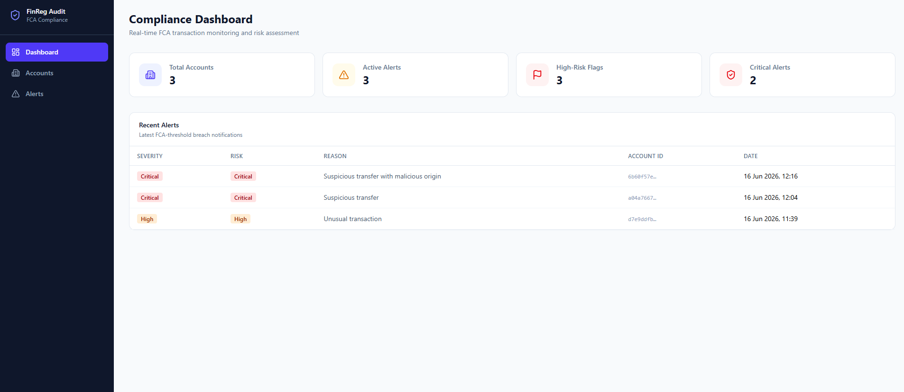
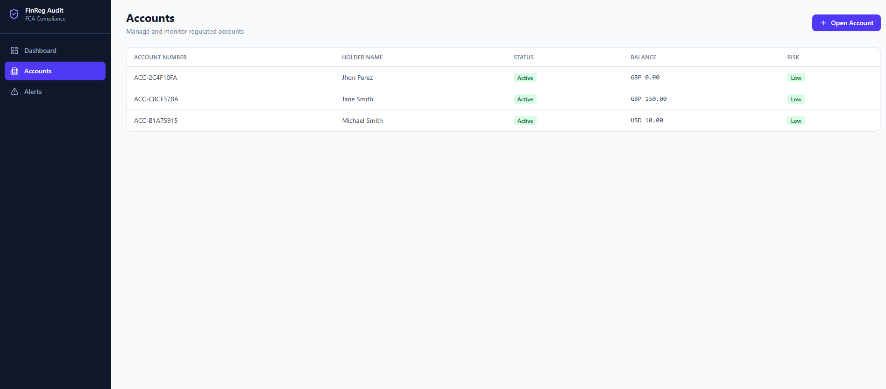
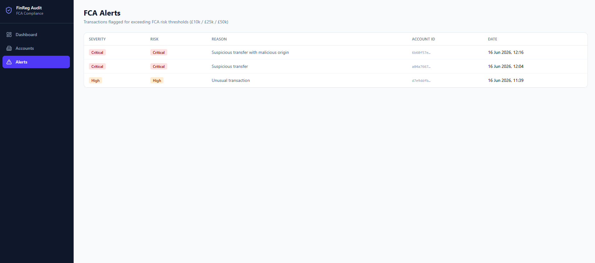

# FinReg Audit

FinReg Audit is a technical platform inspired by financial audit and compliance workflows. It demonstrates event-sourced audit history, account-level evidence, compliance review, and role-aware API authorization.

## Live Demo

[Open the live demo](https://fin-reg-audit.vercel.app)

The Vercel production URL above returned HTTP 200 when this README was updated. Access depends on the deployed API and its environment configuration. Demo credentials are intentionally not documented here because their current end-to-end availability was not verified during this change.

Recruiters can explore the dashboard, accounts, account detail, transactions, risk alerts, compliance report, audit trail, Evidence Rail, event versioning, pagination, and role-aware responses.

## Regulatory Control Room

The interface is designed as a Regulatory Control Room: a restrained operational workspace that prioritizes evidence over decorative metrics. It uses a warm bone surface, graphite navigation, petroleum-blue actions, and copper trace markers. The Evidence Rail makes event sequence, version, and timing easy to scan without implying a certification or legal guarantee.

## Permissions

| Capability | Auditor | ComplianceOfficer |
|---|---:|---:|
| Read accounts, transactions, alerts, compliance and audit trail | Yes | Yes |
| Register risk exception / flag transaction | No | Yes |
| Open account | No | No |
| Complete transaction | No | No |
| Suspend or close account | No | No |
| Resolve or approve alerts | Not implemented | Not implemented |

The API enforces these capabilities with authorization policies. A request without a valid session receives HTTP 401; an authenticated request without the required capability receives HTTP 403. The frontend reflects those capabilities but is not the authorization boundary.

## Audit History

The account-level audit trail presents evidence supplied by the current API contract:

- Event ID
- Aggregate/entity
- Event type
- `OccurredOn`
- Version
- Deterministic ordering by `OccurredOn`, version, and event ID
- UTC timestamp with local display time as secondary context
- Evidence Rail timeline and paginated results

Actor, origin, ingestion time, and payload metadata appear as **Not available** when the API does not provide them. The event store is append-only at application level; it is not described as a cryptographic or database-level guarantee.

## Security Notes

- JWT access tokens are kept in in-memory session state and are not persisted in `localStorage`.
- The frontend handles HTTP 401 and HTTP 403 responses explicitly.
- Backend authorization policies enforce supported capabilities.
- XSS and session-token risks still require defence in depth, including a reviewed Content Security Policy and secure production session design.
- No production tokens or secrets are stored in this repository.

## Design Preview





These are persistent repository previews. A current audit-trail preview is not included because no persistent audit-trail image exists in the repository.

## Architecture

- **Frontend:** React 19, TypeScript, Vite, React Router, TanStack Query, TanStack Table, Zustand, Tailwind CSS, and Lucide React.
- **API:** ASP.NET Core 8, MediatR, FluentValidation, JWT authentication, and Swagger.
- **Application:** CQRS handlers and MediatR pipeline behaviours.
- **Domain:** Event Sourcing, aggregates, domain events, value objects, and business rules.
- **Infrastructure:** Entity Framework Core, Npgsql, PostgreSQL, BCrypt, and repository implementations.
- **Structure:** Clean Architecture keeps Domain and Application independent of infrastructure concerns.

## Local Development

### Prerequisites

- .NET 8 SDK
- Node.js 20+ and pnpm
- Docker, for PostgreSQL and integration tests

### Backend

```bash
docker compose up -d
dotnet run --project src/FinReg.API
```

### Frontend

```bash
cd frontend
pnpm install
pnpm dev
```

## Validation

The most recent local validation completed the following:

- .NET build passed.
- Frontend typecheck passed.
- Vite production build passed.
- 47 unit tests passed.
- Eight integration tests were blocked because Docker/Testcontainers was unavailable.
- Lint passed with two existing TanStack Table / React Compiler compatibility warnings.

No claim is made for physical-device, screen-reader, or fully executed visual QA. Responsive and visual QA remain pending against a running local API.

## Known Limitations

- Cursor pagination is not yet implemented; offset pagination can shift while new events arrive.
- The event store is not a cryptographic or infrastructure-level immutability guarantee.
- The supported roles intentionally do not include an operational account-management role.
- This is a technical demonstration, not a certified or legally compliant financial system.
