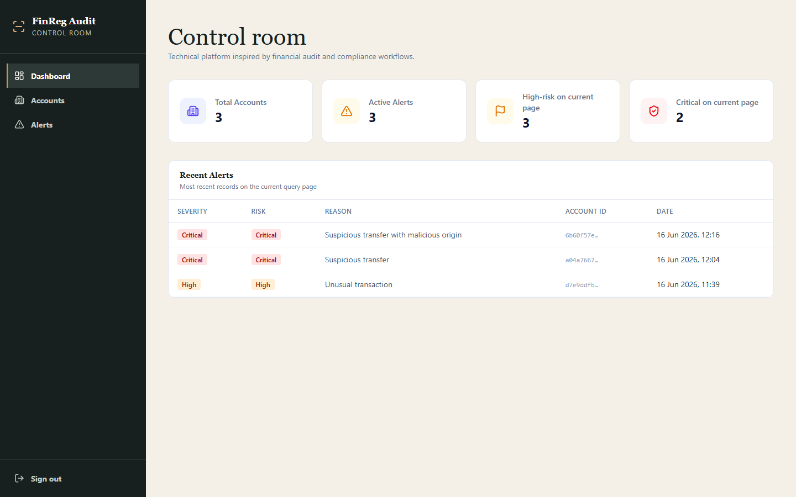
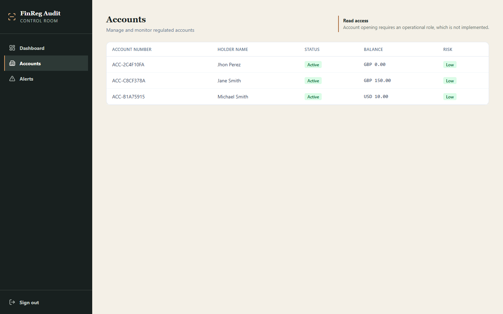
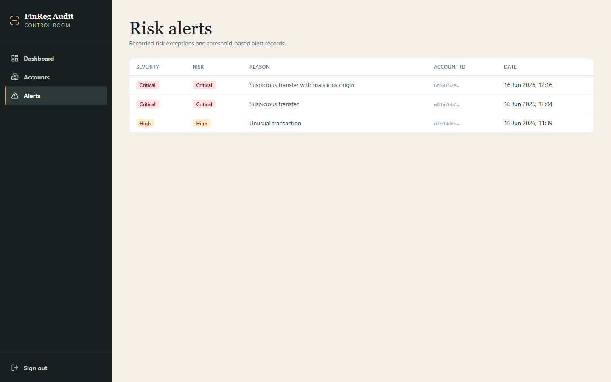
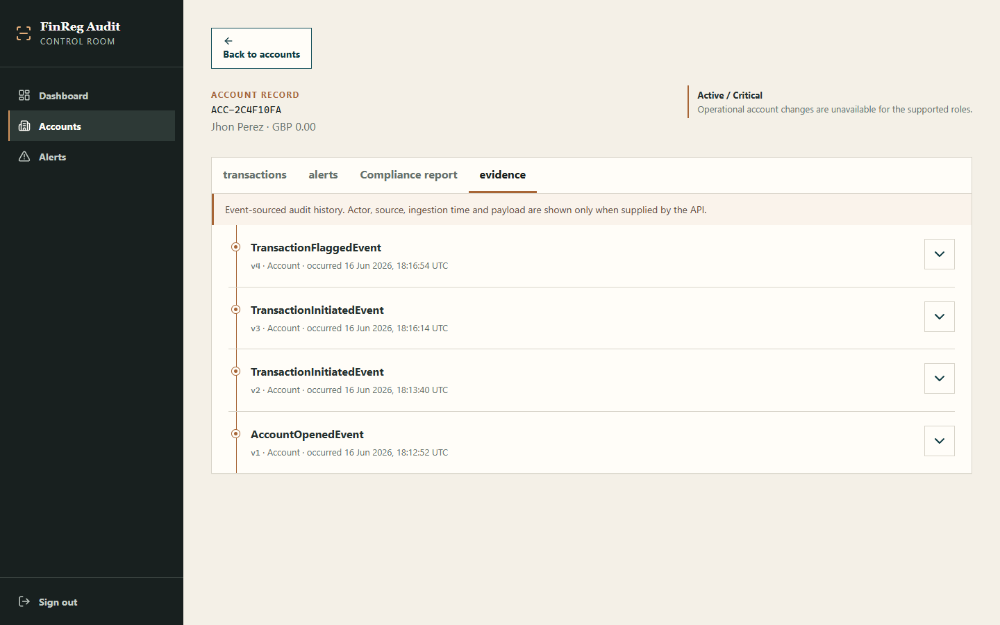
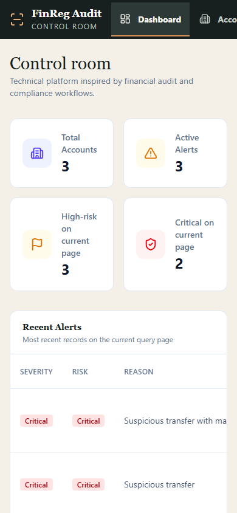

# FinReg Audit

FinReg Audit is a technical platform inspired by financial audit and compliance workflows. It demonstrates event-sourced audit history, account-level evidence, compliance review, and role-aware API authorization.

## Live Demo

- **Frontend:** [fin-reg-audit.vercel.app](https://fin-reg-audit.vercel.app)
- **API (Swagger):** [finreg-audit.fly.dev/swagger](https://finreg-audit.fly.dev/swagger)

The API runs on Fly.io machines that stop when idle, so the first request after a quiet period can take a few seconds.

## Demo Access

| Role | Email | Password |
|---|---|---|
| Auditor (read-only) | `auditor@demo.finreg.dev` | `AuditorDemo-Read-2026` |

- The Auditor can read the dashboard, accounts, account detail, transactions, alerts, compliance report, and audit trail. Every mutation returns HTTP 403.
- The session lives in memory only. Reloading the page or opening a new tab signs you out, and the app returns to the sign-in page. This is the session design, not a routing error: direct links such as `/login` or `/dashboard` are served by the SPA rewrite in `frontend/vercel.json`.
- This is the only published account. All demo data is fictitious.

Verified against production on 2026-09-14: sign-in, all read endpoints, and HTTP 403 for opening, suspending, and closing accounts and for initiating, completing, and flagging transactions.

## Screenshots

Captured on 2026-09-14 from a local production build of the current branch, which includes the account-detail date-format fix and the SPA rewrite, connected to the live API with the demo Auditor account. Desktop captures use a 1440×900 viewport and the mobile capture a 390×844 viewport.








## Regulatory Control Room

The interface is designed as a Regulatory Control Room: a restrained operational workspace that prioritizes evidence over decorative metrics. It uses a warm bone surface, graphite navigation, petroleum-blue actions, and copper trace markers. The Evidence Rail makes event sequence, version, and timing easy to scan without implying a certification or legal guarantee.

## Permissions

| Capability | Auditor | ComplianceOfficer |
|---|---:|---:|
| Read accounts, transactions, alerts, compliance and audit trail | Yes | Yes |
| Register risk exception / flag transaction | No | Yes |
| Open account | No | No |
| Complete transaction | No | No |
| Suspend or close account | No | No |
| Resolve or approve alerts | Not implemented | Not implemented |

The API enforces these capabilities with authorization policies. A request without a valid session receives HTTP 401; an authenticated request without the required capability receives HTTP 403. The frontend reflects those capabilities but is not the authorization boundary.

## Audit History

The account-level audit trail presents evidence supplied by the current API contract:

- Event ID
- Aggregate/entity
- Event type
- `OccurredOn`
- Version
- Deterministic ordering by `OccurredOn`, version, and event ID
- UTC timestamp with local display time as secondary context
- Evidence Rail timeline and paginated results

Actor, origin, ingestion time, and payload metadata appear as **Not available** when the API does not provide them. The event store is append-only at application level; it is not described as a cryptographic or database-level guarantee.

## Security Notes

- JWT access tokens are kept in in-memory session state and are not persisted in `localStorage`.
- The frontend handles HTTP 401 and HTTP 403 responses explicitly.
- Backend authorization policies enforce supported capabilities.
- XSS and session-token risks still require defence in depth, including a reviewed Content Security Policy and secure production session design.
- No production tokens or secrets are stored in this repository. The only published credential is the read-only demo Auditor account above.

## Architecture

- **Frontend:** React 19, TypeScript, Vite, React Router, TanStack Query, TanStack Table, Zustand, Tailwind CSS, and Lucide React.
- **API:** ASP.NET Core 8, MediatR, FluentValidation, JWT authentication, and Swagger.
- **Application:** CQRS handlers and MediatR pipeline behaviours.
- **Domain:** Event Sourcing, aggregates, domain events, value objects, and business rules.
- **Infrastructure:** Entity Framework Core, Npgsql, PostgreSQL, BCrypt, and repository implementations.
- **Structure:** Clean Architecture keeps Domain and Application independent of infrastructure concerns.

## Local Development

### Prerequisites

- .NET 8 SDK
- Node.js 20+ and pnpm
- Docker, for PostgreSQL and integration tests

### Backend

```bash
docker compose up -d
dotnet run --project src/FinReg.API
```

### Frontend

```bash
cd frontend
pnpm install
pnpm dev
```

## Operations

- **Frontend hosting:** Vercel builds the `frontend` directory. `frontend/vercel.json` rewrites client-side routes to `index.html` and leaves `/assets/*`, files with an extension, and `/api` untouched.
- **Demo account provisioning:** [`tools/FinReg.DemoProvisioner`](tools/FinReg.DemoProvisioner/README.md) creates or rotates only the demo Auditor account, without exposing an endpoint.

## Validation

Latest validation (2026-09-14):

- Frontend typecheck and Vite production build passed.
- Frontend date-format regression tests passed (`pnpm test`, 3 tests).
- Lint passed with two existing TanStack Table / React Compiler compatibility warnings.
- `frontend/vercel.json` rewrite checks passed for every client route, leaving `/assets/*`, files with an extension, and `/api` untouched.
- Production API checks with the demo Auditor passed: sign-in, read endpoints, and HTTP 403 for all six unsupported mutations.
- Backend: .NET build passed and 47 unit tests passed; eight integration tests were blocked because Docker/Testcontainers was unavailable.

No claim is made for physical-device or screen-reader testing.

## Known Limitations

- Sessions are not persisted, so a reload requires signing in again.
- Cursor pagination is not yet implemented; offset pagination can shift while new events arrive.
- The event store is not a cryptographic or infrastructure-level immutability guarantee.
- The supported roles intentionally do not include an operational account-management role.
- This is a technical demonstration, not a certified or legally compliant financial system.
